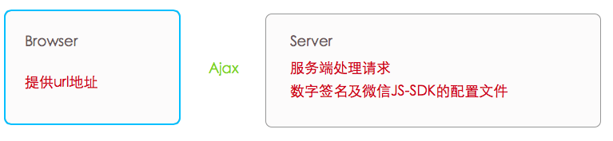

# 微信JS-SDK“分享信息设置”API及数字签名生成方法（NodeJS版本）

Demo:
[cnblogs][wechat-JS-SDK-demo]

## 用异步ajax的方式获取数字签名

在服务器端用NodeJS跑起一个数字签名生成服务，web端用ajax方式请求NodeJS服务获取数字签名信息

得到信息后配置微信JS-SDK



## 步骤

### 第一步 认证的微信公众帐号

首先你得拥有一个通过认证了的微信公众号或者开发者帐号，没有通过认证的公众帐号。数字签名认证也能成功，但是分享信息是无法设置成功的
 
### 第二步 添加安全域名

在公众帐号平台后台添加app运行的域名地址，可以理解为为某个域名添加白名单功能

以`yhtml5.com`为例：
微信公众号是：yhtml5, 添加了yhtml5.com为安全域名，那么我在yhtml5.com上的网页可以使用公众帐号的数字签名了
 
### 第三步 生成数字签名

在微信公众平台后台上面能找到一个 appid 及 secret字符串
通过这两个数据，请求微信提供的两个公开API地址，生成对应的**access_token**后再生成**ticket**再通过规则加密成数字签名
注意，数字签名必须在服务端生成，这里我以NodeJS来实现
数字签名具体生成过程，NodeJS版本


#### 1、获取微信签名所需的access_token
```
https.get('https://api.weixin.qq.com/cgi-bin/token?grant_type=client_credential&appid=你的appid写在这里&secret=你的secret写在这里', function(_res) {
               // 这个异步回调里可以获取access_token
          })
```
#### 2、获取微信签名所需的ticket
```
https.get('https://api.weixin.qq.com/cgi-bin/ticket/getticket?access_token=上一步中获取的access_token&type=jsapi', function(_res){
         // 这个异步回调里可以获取ticket
});
```
#### 3、生成数字签名具体方法
ticket、 noncestr、timestamp、url通过微信的规则用sha1加密noncestr和timestamp在微信官方sample包中有具体的生成方法函数
```
 // noncestr
 var createNonceStr = function() {
      return Math.random().toString(36).substr(2, 15);
 };
 // timestamp
 var createTimeStamp = function () {
      return parseInt(new Date().getTime() / 1000) + '';
 };
```

也可以参考我代码中的代码
```
 // 计算签名方法
 var calcSignature = function (ticket, noncestr, ts, url) {
      var str = 'jsapi_ticket=' + ticket + '&noncestr=' + noncestr + '&timestamp='+ ts +'&url=' + url;
      shaObj = new jsSHA(str, 'TEXT');
      return shaObj.getHash('SHA-1', 'HEX');
 }
 var signature = calcSignature(ticket, noncestr, timestamp, url);
```
#### 4、返回输出signature数字签名以及在生成数字签名时用到的timestamp、nonceStr、url、及appid

因为在客户内初始化微信JS-SDK中还要用到
 
#### 5、至此数字签名生成成功

### 第四步 在web中如何使用数字签名？

#### 1、引入微信JS-SDK

> http://res.wx.qq.com/open/js/jweixin-1.0.0.js
 
#### 2、请求服务器获取数字签名

在web上用ajax方式请求NodeJS服务地址，请求时将当前web地址url上传至服务器
> url demo: http://yhtml5.com?11#hoome
可用`location.href.split('#')[0]`获得动态url

服务器生成数字签名后返回：
signature，timestamp, appid, nonceStr
这四个数据用于配置微信JS-SDK
```
wx.config({
          debug: true,
          appId: appid,
          timestamp: timestamp,
          nonceStr: nonceStr,
          signature: signature,
          jsApiList: [
              'checkJsApi',
              'onMenuShareTimeline',
              'onMenuShareAppMessage',
              'onMenuShareQQ',
              'onMenuShareWeibo',
              'hideMenuItems',
              'chooseImage'
          ]
      });
```

3、在wx.ready内调用API
```        
wx.ready(function(){
                   var sdata = {
                        title: '那年|时光遗忘了，文字却清晰地复刻着',
                        desc: '那年|时光遗忘了，文字却清晰地复刻着',
                        link: 'http://game.4gshu.com/deep-love/index2.html',
                        imgUrl: 'http://game.4gshu.com/xuangedan/other-project/2015-01-06/img/share-wx-logo.jpg',
                        success: function () {
                            alert('用户确认分享后执行的回调函数');
                        },
                        cancel: function () {
                            alert('用户取消分享后执行的回调函数');
                        }
                    };
                   wx.onMenuShareTimeline(sdata);
                   wx.onMenuShareAppMessage(sdata);
               });
```

### 关于数字签名过期与微信API的1w次请求的限制问题
 
由于微信提供的两个数字签名生成API有7200秒的有效期，并且暂时有1w次的限制，所以在我们自己服务器上需要将数字签名缓存
 
逻辑是：
如果用户请求时没缓存中没有数字签名，那么请求执行第三步 生成数字签名
如果缓存中有，并且是在2小时内那么直接返回数字签名信息，不去请求微信服务器
如果缓存中的数字签名过期了(超过2小时)则还是执行第三步 生成数字签名
 
注意：由于微信规定地址栏中的参数发生变化都认作是新的请求地址，数字签名也需要重新生成。
 
新生成的数字签名将存入cachedSignatures对象内
缓存中的数据结构将url设为key
数据结构如下：
```
var cachedSignatures =  {
               'http://game.4gshu.com/': {
                    appid: ’微信认证帐号的的appid',
                    secret: '微信认证帐号的secret',
                    timestamp: '1421135250',
                    noncestr: 'ihj9ezfxf26jq0k'
               }
          }
```

### Question

1.签名算法不一致： 通过 http://mp.weixin.qq.com/debug/cgi-bin/sandbox?t=jsapisign 验证算法正确性

2.url 必须完全一致，并且外网可访问。 将代码部署到 BAE ，或者其他应用引擎服务器上。

3.timestamp 需要精确到秒。

[wechat-JS-SDK-demo]:http://www.cnblogs.com/willian/p/4254963.html?utm_source=tuicool&utm_medium=referral
[wechat-JS-SDK-demo-github]:https://github.com/willian12345/wechat-JS-SDK-demo