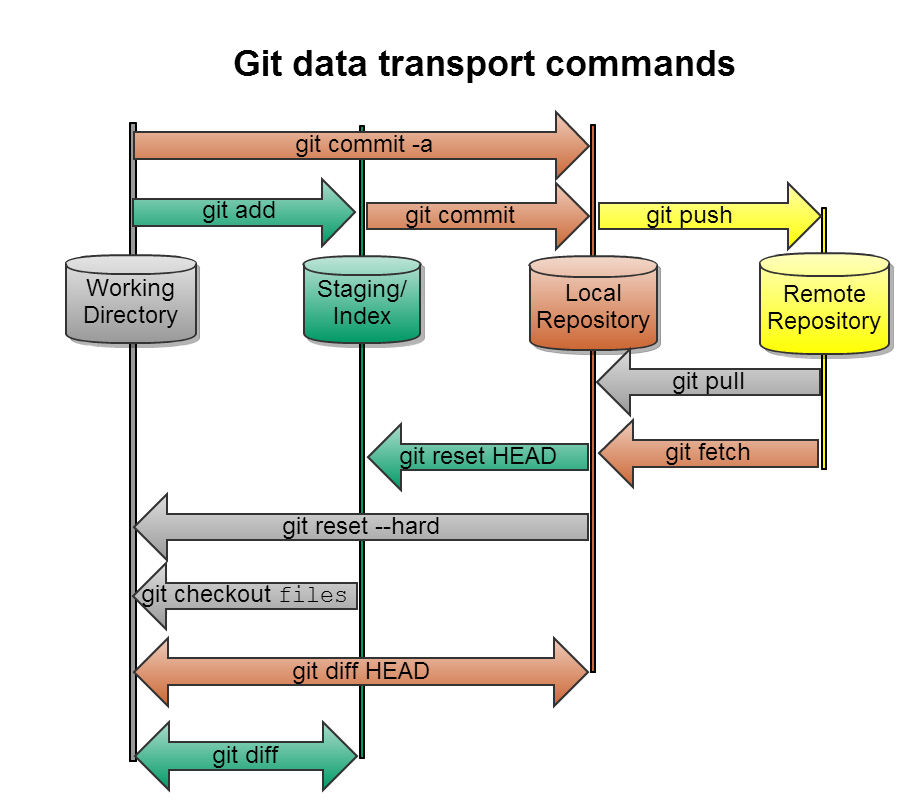

# Git Tutorial

## git 常用命令大全

- [Git Tutorial](#git-tutorial)
  - [git 常用命令大全](#git-常用命令大全)
  - [ssh](#ssh)
  - [git init](#git-init)
  - [git clone](#git-clone)
  - [git diff](#git-diff)
  - [git reset](#git-reset)
  - [git status](#git-status)
  - [git add](#git-add)
  - [git commit](#git-commit)
  - [git remote](#git-remote)
  - [git fetch](#git-fetch)
  - [git pull](#git-pull)
  - [git push](#git-push)
  - [git merge](#git-merge)
  - [git checkout](#git-checkout)
  - [git stash](#git-stash)
  - [others](#others)
  - [git tag](#git-tag)
  - [git branch](#git-branch)
  - [git log](#git-log)
  - [git config](#git-config)



## [ssh](../ssh/README.md)

## git init

- git init `初始化Git仓库`
- sudo git init --bare sample.git `创建裸仓库`

## git clone

- git clone `克隆`
  - `ssh://userName@ipAddress:port/path/repository.git`
  - `../test/sample.git`
  - --depth=1  `克隆深度为最近一次提交`

## git diff

- git diff HEAD -- filename `查看具体修改内容`
- git diff master origin/master `比较本地分支和远程分支的差异`

## git reset

- git reset
  - HEAD file `将暂存区的修改退回工作区`
  - --hard HEAD^ `返回到上个版本（上上个版本：HEAD^^；往上100个版本：HEAD~100)`
  - --hard 版本号 `回到删除的版本（当前命令行窗口未关闭；版本号没必要写全)`
- git reset --hard `<commit-hash>` && git push -f origin master   `撤销之前提交的commit(没有被其他人pull过) 但是如果有其他人同步过你的push，那么你可以在本地使用revert来还原你提交的commit，然后生成一个新的commit然后再推送到远端`

## git status

- git status `查看修改状态`

## git add

- git add `把要提交的所有修改放到暂存区`
- git add readme `添加文件到版本库`

## git commit

- git commit `一次性把暂存区的所有修改提交到分支`
  - -m "info" `将暂存区提交到本地仓库, 增加提交说明info`
  - -am "info" `git add + git commit`

## git remote

- git remote `不带参数，列出已经存在的远程分支`
  - -v `列出详细信息, 如果有子命令，-v 需要放在git remote与子命令中`
  - --verbose
- git remote add origin <git@github.com>:chenyexing/learngit.git
  - `Adds a remote named **name** for the repository at **url**`
  - origin git@server-name:path/repo-name.git `关联一个远程库`
- git remote set-url git@server-name:path/repo-name.git `配置git远程url`

## git fetch

- git fetch `将远程仓库的所有分支commit取回本地`
  - --all `将远程所有仓库的所有分支commit取回本地`
- git fetch origin master `将远程仓库origin的master分支commit取回本地`

> [Git少用Pull多用Fetch和Merge](https://www.cnblogs.com/flying_bat/p/3408634.html)

## git pull

- git pull  `git fetch + git merge origin/branch`
  - --all `拉取远程所有仓库的commit信息下载合并到本地分支`

## git push

- git push `<远程主机名>` `<本地分支名>`:`<远程分支名>`
  - --all `拉取远程所有仓库的commit信息下载合并到本地分支`
  - -u origin master  `推送master分支并关联本地与远程的分支(第一次加-u)`
- git push origin **branch-name**  `推送本地分支到远程库`
- git push origin **tagname**  `推送一个本地标签`
- git push origin :**branchName**  `删除远程分支`
- git push origin :refs/tags/**tagname**  `删除远程标签`
- git push origin
  - --delete **branchName**  `删除远程分支`
  - --delete **tagname**   `删除远程标签`
  - --tags `推送全部尚未推送到远程的本地标签`

## git merge

- git merge **name** `合并某分支到当前分支`
- git merge **name** --no-ff -m "merge" -dev `禁用 Fast formard 模式(删除分支后,丢掉分支信息,看不出历史合并记录)`
- git merge --abort `撤销合并`

## git checkout

- git checkout `把误删文件恢复`
  - -- file `丢弃工作区的修改`
  - -b branch-name `创建+切换分支`
  - -b branch-name origin/branch-name `本地创建+切换和远程分支对应的分支(本地和远程分支的名称最好一致)`
  - -b --track branch-name origin/branch-name `基于远程跟踪分支创建本地分支`

## git stash

- git stash `储藏当前工作现场`
- git stash list `查看临时储藏的工作现场`
- git stash show `检查工作现场`
- git stash apply stash@{2}`应用储存`
- git stash drop stash@{0}`移除的储藏`
- git stash pop stash@{0} `应用储藏，并将其从堆栈中移走`
- git stash clear `清除stash队列`

> [git stash](https://git-scm.com/book/zh/v1/Git-%E5%B7%A5%E5%85%B7-%E5%82%A8%E8%97%8F%EF%BC%88Stashing%EF%BC%89)

## others

- .gitignore  `.gitignore文件本身要放到版本库里，并且可以对.gitignore做版本管理`
- .gitconfig  `当前用户的Git配置文件放在用户主目录下的一个隐藏文件中`
- sudo chown -R git:git sample.git  `改变权限`
- git rm `用于删除一个文件`

## git tag

- git tag **name** `打标签`
- git tag -a **tagname** -m **note** `创建带有说明的标签`
- git tag -s **tagname** -m **note** `用PGP签名标签`
- git tag -d **tagname** `删除标签（本地）`
- git tag -l --list `查看所有标签`
- git show **tagname** `查看标签信息`

## git branch

```sh
[master]:    dd2e86 - 946992 - 9143a9 - a6fd86 - 5a6057
               |         \
[feature]:     |          76cada - 62ecb3 - b886a0
               |
[bug]:       ad2112 - ca2131 - as2131
```

- git branch `查看当前分支（当前分支前会标*）`
- git branch -a  `查看所有分支(远程)`
- git branch -m dev1 dev2  `重命名分支`
- git branch **name** `创建分支`
- git branch -d **name** `删除分支`
- git branch -D **name** `强行删除没有合并过的分支`
- git branch **name**  **SHA1值** `恢复删除的分支`
- git branch --set-upstream branch-name origin/branch-name `建立本地分支和远程分支的关系`
- git branch --set-upstream-to=origin/dev dev `建立本地分支和远程分支的关系`
- git cherry-pick 62ecb3  `合并其它分支的一次提交到当前分支`
- git cherry-pick --abort `撤销这次合并`
- git rebase --onto feature ad2112 ca2131 `!将ad2112-ca2131的提交衍合到feature分支`

## git log

- git log `查看历史记录（最近到最远显示），以便确定要回退到哪个版本`
- git log --pretty=oneline  `简化log`
- git log --graph `查看分支合并图`
- git log --graph --pretty=oneline --abbrev-commit `缩写commithash`
- git log --pretty=oneline `查看减少后的历史记录`
- git log --author=yhtml5  `只查看该作者提交记录`
- git log -p -2 `-p 选项展开显示每次提交的内容差异，用 -2 则仅显示最近的两次更新`
- git reflog `查看命令历史，以便确定要回到未来的哪个版本`

## git config

- git config --list  `显示当前配置信息`
- git config --global color.ui true  `让Git显示颜色`
- git config --global user.name "Your Name"  `global参数, 表示你这台机器上所有的Git仓库都会使用这个配置`
- git config --global user.email "<email@example.com>"
- git config --global alias.st status
- git config --global alias.co checkout
- git config --global alias.ci commit
- git config --global alias.br branch
- git config --global alias.unstage 'reset HEAD'
- git config --global alias.last 'log -1'
- git config --global alias.lg "log --color --graph --pretty=format:
- '%Cred%h%Creset -%C(yellow)%d%Creset %s %Cgreen(%cr) %C(bold blue)<%an>%Creset' --abbrev-commit"

```shell
cat .gitconfig
[alias]
  co = checkout
  ci = commit
  br = branch
  st = status
[user]
  name = Your Name
  email = your@email.com
```
